# Component Diagram - CharityDonation System

This diagram describes the high-level architecture of the Spring Boot application, showing the separation of concerns and the interfaces between layers.

```mermaid
graph TD
    %% Presentation Layer
    subgraph Presentation_Layer [Presentation Layer - Spring MVC]
        UI[Browser / JSP Views]
        Interceptor[SecurityInterceptor]
        
        subgraph Controllers
            AC[AdminController]
            HC[HomeController]
            UC[UserController]
            AuthC[AuthController]
        end
    end

    %% Business Logic Layer
    subgraph Business_Layer [Business Logic Layer - Service]
        direction TB
        subgraph Service_Interfaces
            USI(UserService Interface)
            CSI(CampaignService Interface)
            DSI(DonationService Interface)
            ESI(EmailService Interface)
        end
        
        subgraph Service_Implementations
            USImpl[UserServiceImpl]
            CSImpl[CampaignServiceImpl]
            DSImpl[DonationServiceImpl]
            ESImpl[EmailServiceImpl]
        end
    end

    %% Data Access Layer
    subgraph Data_Access_Layer [Data Access Layer - Spring Data JPA]
        subgraph Repositories
            UR[UserRepository]
            CR[CampaignRepository]
            DR[DonationRepository]
            RR[RoleRepository]
        end
    end

    %% Persistence Layer
    subgraph Persistence_Layer [Persistence Layer]
        DB[(MySQL Database)]
    end

    %% Cross-cutting
    subgraph Models
        Entities[Entities: User, Campaign, Donation, etc.]
        DTOs[DTOs: UserDTO, CampaignDTO, DonationDTO]
    end

    %% Relationships
    UI <--> Interceptor
    Interceptor <--> Controllers
    
    AC -.-> USI
    AC -.-> CSI
    AC -.-> DSI
    
    HC -.-> CSI
    HC -.-> DSI
    HC -.-> USI
    
    UC -.-> USI
    UC -.-> DSI
    
    AuthC -.-> USI
    
    %% Service Implementation Realization
    USImpl -- implements --> USI
    CSImpl -- implements --> CSI
    DSImpl -- implements --> DSI
    ESImpl -- implements --> ESI
    
    %% Service to Repository
    USImpl --> UR
    USImpl --> RR
    CSImpl --> CR
    DSImpl --> DR
    DSImpl --> CR
    
    %% Repository to DB
    UR --> DB
    CR --> DB
    DR --> DB
    RR --> DB

    %% Data flow usage
    Controllers -.-> DTOs
    Service_Implementations -.-> Entities
    Service_Implementations -.-> DTOs
```

### Key Architectural Notes:
1. **Presentation Layer**: Handles incoming HTTP requests and security filtering via the `SecurityInterceptor`. It communicates only with the Service interfaces.
2. **Business Layer**: Encapsulates all business rules. Implementation classes (e.g., `DonationServiceImpl`) handle transaction management and data validation logic.
3. **Data Access Layer**: Uses Spring Data JPA to abstract database operations. No manual SQL is written; it relies on interface-based repository patterns.
4. **Persistence Layer**: A standard MySQL database where the physical data resides.
5. **DTOs**: Data Transfer Objects are used to pass data from the Service layer to the View, ensuring internal entity structures are not exposed directly to the client.
