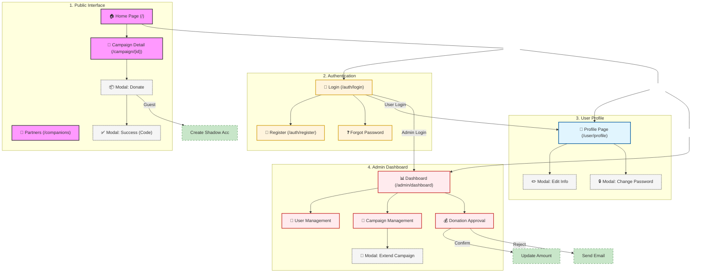

# Project Screen Flow Diagram

This document contains the detailed screen flow for the CharityDonation project, represented using Mermaid syntax. You can render this diagram using the Mermaid Live Editor or any Markdown viewer that supports Mermaid.

